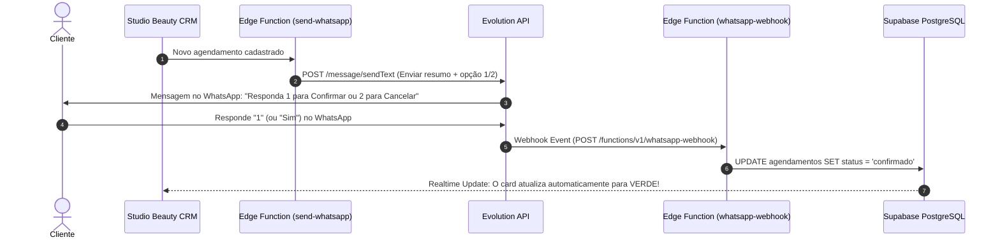

# Integration: Evolution API + Supabase Edge Functions

Esta documentação descreve o fluxo completo de envio automático de mensagens e confirmação de agendamentos via WhatsApp utilizando a **Evolution API** e as **Supabase Edge Functions**.

---

## 🔁 Fluxo Completo de Funcionamento



---

## 🛠️ Step 1: Configurar as Variáveis no Supabase (Secrets)

No terminal do seu projeto, defina as credenciais da sua instância da **Evolution API**:

```bash
npx supabase secrets set EVOLUTION_API_URL="https://sua-evolution-api.com"
npx supabase secrets set EVOLUTION_API_KEY="SUA_API_KEY_AQUI"
npx supabase secrets set EVOLUTION_INSTANCE_NAME="sua_instancia"
```

---

## 🚀 Step 2: Fazer Deploy das Edge Functions

Execute os comandos abaixo para publicar as duas funções no Supabase:

### 1. Função de Envio de Mensagens:
```bash
npx supabase functions deploy send-whatsapp --no-verify-jwt
```

### 2. Função de Webhook (Recebe a resposta 1 ou 2 do cliente):
```bash
npx supabase functions deploy whatsapp-webhook --no-verify-jwt
```

---

## ⚙️ Step 3: Configurar o Webhook no Painel da Evolution API

No painel administrativo da **Evolution API** ou via chamada de API, configure a URL do webhook para escutar mensagens recebidas:

- **Webhook URL:** `https://<SEU_PROJETO_SUPABASE>.supabase.co/functions/v1/whatsapp-webhook`
- **Events:** `MESSAGES_UPSERT` (ou mensagens recebidas)
- **Enabled:** `true`

---

## ✅ Pronto!

Agora, sempre que um novo agendamento for registrado:
1. A cliente receberá a mensagem no WhatsApp.
2. Ao responder **1** (ou "sim"), o status mudará automaticamente para **`confirmado`** no CRM.
3. Ao responder **2** (ou "cancelar"), o status mudará para **`cancelado`**.
